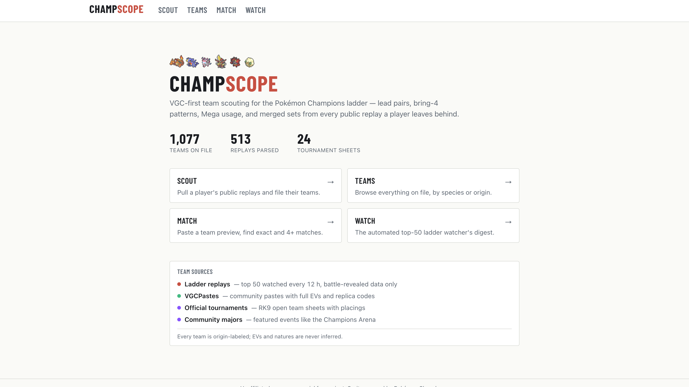
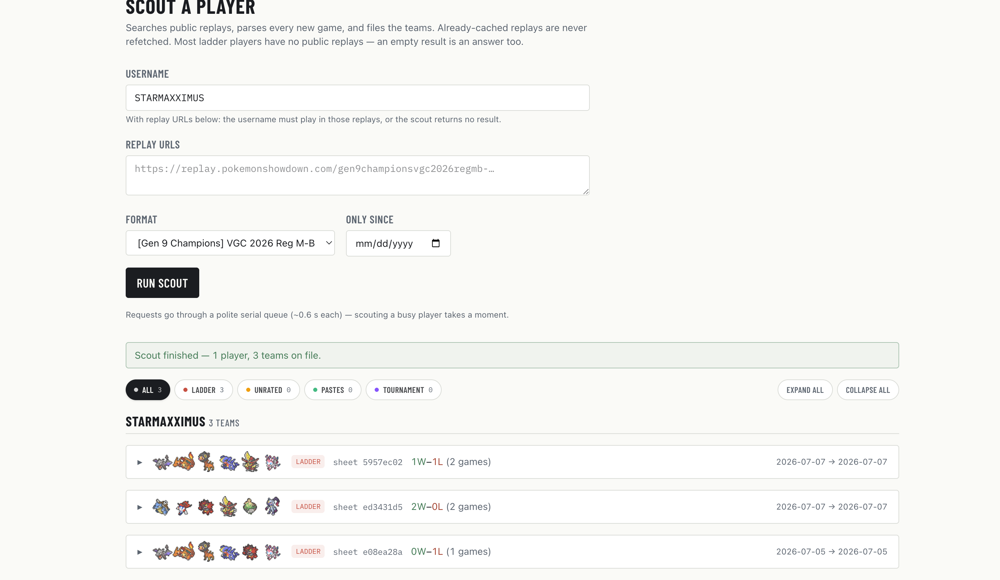
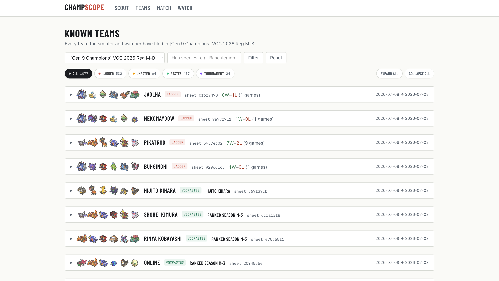
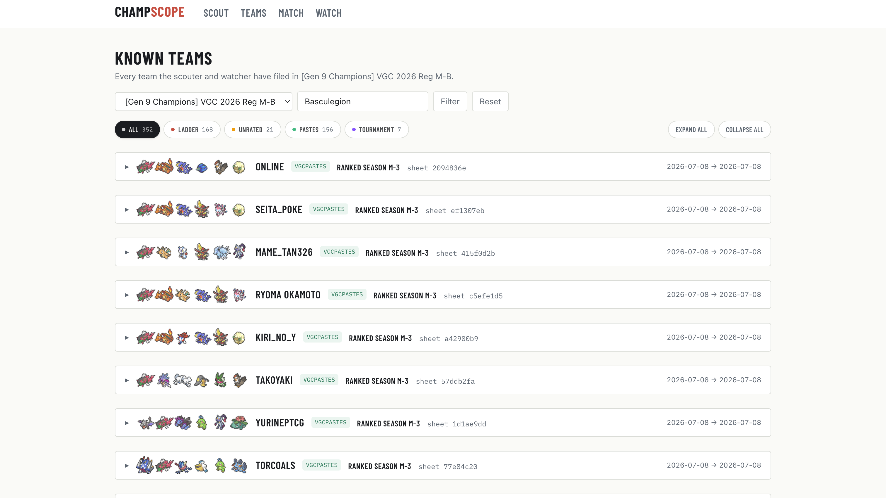
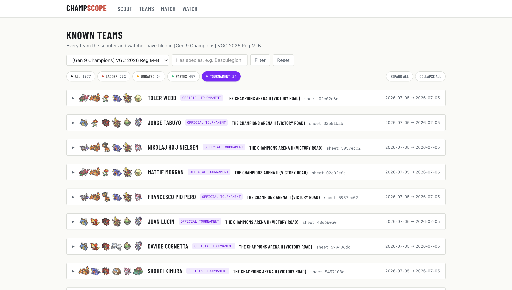
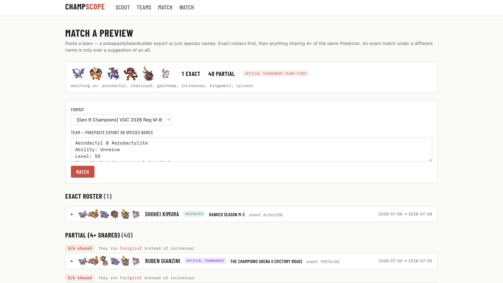
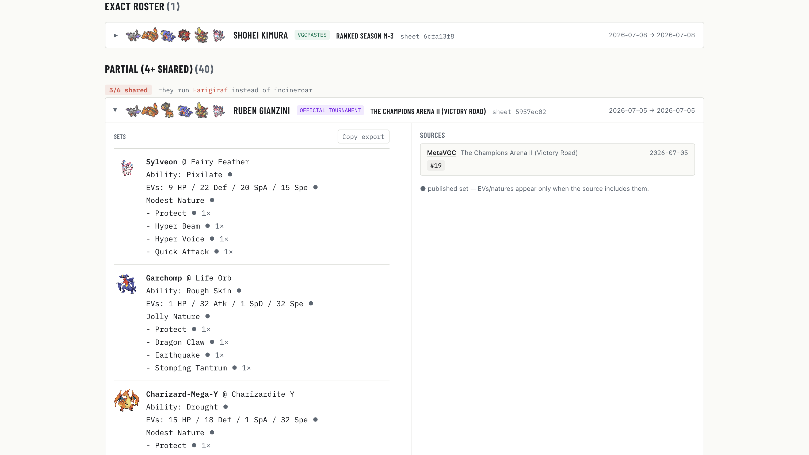
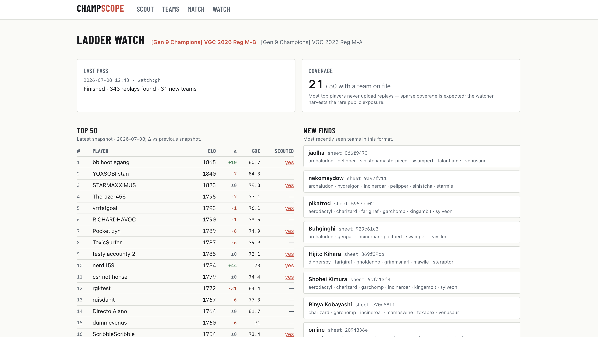

# Champscope

VGC-first Pokémon Showdown scouting suite for the Pokémon Champions era: a replay scouter web app plus a scheduled ladder watcher that builds a persistent team database. Unaffiliated, non-commercial fan project — no Pokémon assets are bundled; sprites are hotlinked from the official Showdown client.

**Live:** https://champscope.vercel.app

Spec: [CHAMPSCOPE.md](CHAMPSCOPE.md) · Architecture notes, gotchas & production ops: [docs/ARCHITECTURE.md](docs/ARCHITECTURE.md) · Team sources: [docs/TEAM-SOURCES.md](docs/TEAM-SOURCES.md)

## What it does

### Scout a player

Search any player's public replays, parse every game, and file their teams — merged sets with provenance (open team sheet vs revealed in battle), lead pairs, bring-4 patterns, and Mega usage. Scouting by replay URL works too.

### Browse every known team

Teams accumulate from four origins — ladder replays, unrated replays, community pastes, and tournament sheets — each color-labeled, with whole-format counts and Showdown-style team preview strips. Cards expand into full Pokepaste-style sets that copy cleanly into the teambuilder.

Filter by species and origin:

Official and community tournament teams (open team sheets with placings — e.g. The Champions Arena II) rank first where it matters:

### Match an opponent's preview

Paste a team preview (export text or just species names) and find it on file — exact rosters, then anything sharing 4+ Pokémon, tournament teams first. Expanded cards show full published sets, EV spreads when the source includes them, and where each team came from:

### Watch the ladder

An automated watcher snapshots the top 50 daily, scouts every player with public replays, and reports coverage, rating movement, and newly seen teams:

## Team sources

- **Ladder replays** — the daily watcher + ad-hoc scouts; battle-revealed data only, cached forever, never refetched
- **VGCPastes** — curated community pastes with full EVs and replica codes
- **pokedata.ovh** — officially published tournament team sheets (RK9) with placings and records
- **MetaVGC featured events** — community majors with full sets including EV spreads

Every team is origin-labeled and deduped per source; EVs and natures are never inferred.

## Setup

1. Create a Supabase project and run [`schema.sql`](schema.sql) in the SQL editor (idempotent; seeds the verified Champions formats).
2. `cp .env.example .env.local` and fill in the values.
3. `npm install && npm run dev`

## Deploy

- Vercel project with the same env vars (`SUPABASE_URL`, `SUPABASE_SERVICE_ROLE_KEY`, `CRON_SECRET`, `SHOWDOWN_CONTACT`). `vercel.json` registers the once-daily fallback cron (06:00 UTC).
- GitHub repo: add secret `CRON_SECRET` and variable `WATCH_URL` (`https://<app>.vercel.app/api/watch/run`) for [`.github/workflows/watch.yml`](.github/workflows/watch.yml), which fires daily at 06:15 UTC and drives the chunked watcher until the pass completes (each hit does ~7 s of work and persists a cursor; passes cool down for 11 h).
- Variable `INGEST_URL` (`https://<app>.vercel.app/api/ingest/run`) for [`.github/workflows/ingest.yml`](.github/workflows/ingest.yml), the daily team-source ingest at 06:45 UTC (VGCPastes + pokedata.ovh + MetaVGC).

## Commands

- `npm test` — parser/merge/export unit + snapshot tests (real replay fixtures in `test/fixtures/`)
- `npm run reparse` — after bumping `PARSER_VERSION`: re-parse all cached replays and rebuild replay-derived team profiles (never refetches; imported teams are untouched)
- `npx tsx scripts/dev-ingest.ts` — run the team-source ingest against whatever DB `.env.local` points to
- `npx tsx scripts/fetch-fixtures.ts` — refresh test fixtures from the live replay archive
- `npx tsx scripts/build-sprite-data.ts` — regenerate the icon-index / sprite-id data files

## Politeness

All Showdown traffic goes through a single serial queue (≥600 ms between requests, honest User-Agent, exponential backoff, permanent replay cache). Keep it that way.
